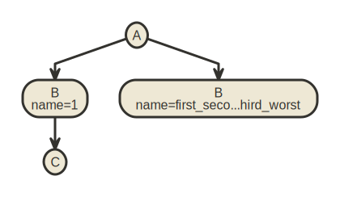

# xmlim

xmlim (pronounced ex-em-el-im) is a CLI for generating diagrams of XML documents. XML is hierarchical, so a tree diagram is well suited for representing the structure of an XML document.

* [Example](#example-diagram)
<!-- toc -->
* [xmlim](#xmlim)
* [Usage](#usage)
* [Commands](#commands)
* [Command Topics](#command-topics)
<!-- tocstop -->

## Example Diagram

Given the following XML:

```xml
<A>
  <B name="1">
    <C />
  </B>
  <B name="first_second_third_worst"/>
</A>
```

This diagram is generated:



# Usage

<!-- usage -->
```sh-session
$ npm install -g xmlim
$ xmlim COMMAND
running command...
$ xmlim (--version)
xmlim/0.0.0 linux-x64 node-v18.15.0
$ xmlim --help [COMMAND]
USAGE
  $ xmlim COMMAND
...
```
<!-- usagestop -->

# Commands

<!-- commands -->
# Command Topics

* [`xmlim gen`](docs/gen.md) - Generate a diagram from the given XML file
* [`xmlim help`](docs/help.md) - Display help for xmlim.
* [`xmlim plugins`](docs/plugins.md) - List installed plugins.
* [`xmlim watch`](docs/watch.md) - Watch a file or directory for changes and re-generate a new diagram

<!-- commandsstop -->

## Implementation notes

- CLI command processing and application scaffolded using [oclif](https://github.com/oclif/oclif)
- XML parsing using https://github.com/rgrove/parse-xml
- Diagram generation using https://www.nomnoml.com/
